# 🏦 Bank Loan Analysis Dashboard

## Project Overview

The **Bank Loan Analysis Dashboard** is an end-to-end Data Analytics project designed to analyze lending operations, borrower behavior, loan quality, funding performance, and repayment trends of a bank.

This project uses **SQL Server**, **Excel Dashboarding**, and **Business Intelligence techniques** to transform raw loan data into meaningful insights for decision-making.

The dashboard helps management monitor:

- Total Loan Applications
- Funded Amount
- Received Amount
- Interest Rate Trends
- Debt-to-Income Ratio
- Good Loans vs Bad Loans
- Regional Loan Performance
- Borrower Segmentation
- Loan Purpose Analysis

# Business Objective

Banks process thousands of loan applications. Manual analysis of such large data is inefficient.

This project solves the problem by building an interactive dashboard that enables:

- Better lending decisions
- Risk monitoring
- Portfolio performance tracking
- Fraud and default trend analysis
- Customer segmentation
- Strategic planning

# Tools & Technologies Used

| Tool | Purpose |
|------|---------|
| SQL Server | Data Cleaning & KPI Queries |
| Excel | Dashboard Visualization |
| Pivot Tables | Calculations |
| Charts & KPIs | Reporting |

# Dataset Information

The dataset contains bank loan records with borrower and loan information.

## Main Columns Used

- Loan ID
- Address State
- Employee Length
- Employee Title
- Grade
- Sub Grade
- Home Ownership
- Issue Date
- Loan Status
- Purpose
- Term
- Verification Status
- Annual Income
- DTI
- Installment
- Interest Rate
- Loan Amount
- Total Payment

# Dashboard Structure

The project contains **3 dashboards**:

1. Summary Dashboard  
2. Overview Dashboard  
3. Details Dashboard  

# Dashboard 1: Summary

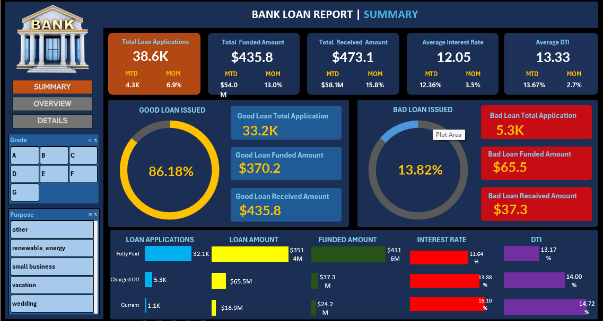

## KPIs Included

### Loan Metrics

- Total Loan Applications → **38.6K**
- Total Funded Amount → **$435.8M**
- Total Received Amount → **$473.1M**
- Average Interest Rate → **12.05%**
- Average DTI → **13.33%**

### Month-to-Date Tracking

- MTD Loan Applications
- MTD Funded Amount
- MTD Received Amount
- MoM Growth %

## Good Loan vs Bad Loan Analysis

### Good Loans

Loan Status:

- Fully Paid
- Current

Metrics:

- Good Loan % = **86.18%**
- Applications = **33.2K**
- Funded = **$370.2M**
- Received = **$435.8M**

### Bad Loans

Loan Status:

- Charged Off

Metrics:

- Bad Loan % = **13.82%**
- Applications = **5.3K**
- Funded = **$65.5M**
- Received = **$37.3M**

# Dashboard 2: Overview

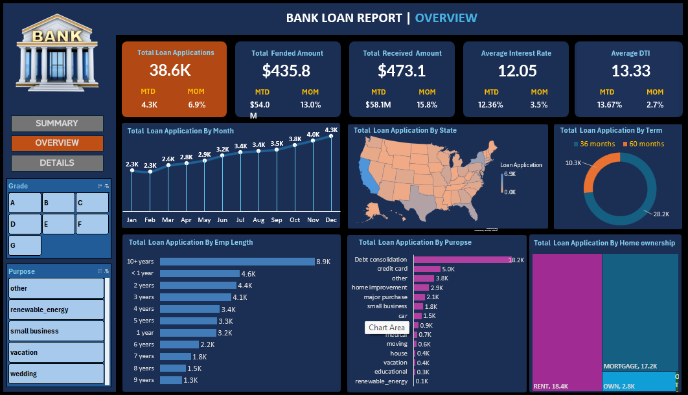

## Visual Reports Included

### 1. Monthly Trend Analysis (Line Chart)

Tracks monthly:

- Loan Applications
- Funded Amount
- Amount Received

### 2. State Wise Loan Distribution (Filled Map)

Shows loan demand by state.

### 3. Loan Term Analysis (Donut Chart)

Loan terms:

- 36 Months
- 60 Months

### 4. Employment Length Analysis (Bar Chart)

Loan trends by employment duration.

### 5. Purpose Analysis (Bar Chart)

Loan reasons:

- Debt Consolidation
- Credit Card
- Home Improvement
- Small Business
- Vacation
- Education

### 6. Home Ownership Analysis (Tree Map)

Categories:

- Rent
- Mortgage
- Own

# Dashboard 3: Details Dashboard

Provides complete loan-level transaction records for detailed analysis including:

- Borrower Profile
- Loan Status
- Payment Tracking
- Income & DTI
- Interest Rate
- Grade / Risk Level

## SQL Business Analysis – Bank Loan Portfolio

#### We performed structured analysis in SQL on the `bank_loan_data` dataset to answer key lending and business performance questions. 

#### 1️⃣ Total Loan Applications – Measured total customer demand for loans.

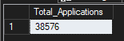

➡️ Counted all loan applications submitted in the dataset.
This KPI reflects overall customer acquisition and lending demand.

#### 2️⃣ Month-to-Date (MTD) Loan Applications – Current month performance tracking.

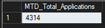

➡️ Calculated total applications for **December 2021**.
Helps monitor recent lending activity and compare current momentum.

#### 3️⃣ Previous Month-to-Date (PMTD) Applications – Historical comparison.

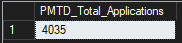

➡️ Measured total applications for **November 2021**.
Used to compare month-over-month growth trends.

#### 4️⃣ Total Funded Amount – Overall capital deployed.

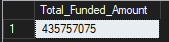

➡️ Summed all approved/disbursed loan amounts.
Represents how much money the institution has lent to borrowers.

#### 5️⃣ MTD Funded Amount – Current month disbursement.

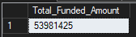

➡️ Total loan amount funded in **December 2021**.
Useful for monthly sales and lending targets.

#### 6️⃣ PMTD Funded Amount – Previous month funding benchmark.

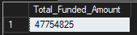

➡️ Total funded amount for **November 2021**.
Helps compare recent lending growth or slowdown.

#### 7️⃣ Total Amount Received – Recovery and repayment performance.

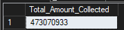

➡️ Summed all customer payments collected.
Measures incoming cash flow from repayments.

#### 8️⃣ MTD Amount Collected – Monthly collections.

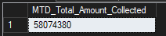

➡️ Total repayments received during **December 2021**.

#### 9️⃣ Average Interest Rate – Lending profitability indicator.

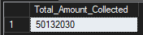

➡️ Calculated average interest rate charged across all loans.
Higher average rates may improve margins but increase risk.

#### 🔟 Average Debt-to-Income Ratio (DTI) – Borrower financial health.

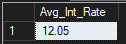

➡️ Measured average DTI of all applicants.
Lower DTI usually indicates stronger repayment ability.

## Loan Quality Analysis

#### 1️⃣ Good Loan Percentage

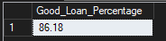

➡️ Loans marked **Fully Paid** or **Current** were classified as good loans.
This indicates a healthy performing portfolio.

#### 2️⃣ Good Loan Applications

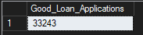

➡️ Counted all performing loan accounts.

#### 3️⃣ Good Loan Funded Amount

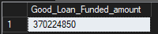

➡️ Total capital deployed to low-risk / active customers.

#### 4️⃣ Good Loan Amount Received

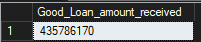

➡️ Total repayments received from performing loans.

#### 5️⃣ Bad Loan Percentage

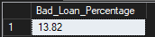

➡️ Loans marked **Charged Off** were classified as bad loans.
This reflects default risk and credit loss exposure.

#### 6️⃣ Bad Loan Applications

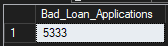

➡️ Number of defaulted customers.

#### 7️⃣ Bad Loan Funded Amount

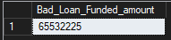

➡️ Total capital lost or at risk due to charge-offs.

#### 8️⃣ Bad Loan Amount Received

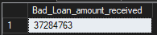

➡️ Payments recovered from bad loans before default.

## Loan Status Performance

### We grouped business metrics by loan status:

* **Fully Paid** → Strongest repayment category
* **Current** → Active borrowers making payments
* **Charged Off** → Defaulted loans requiring risk control

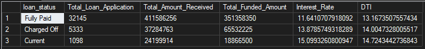
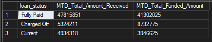
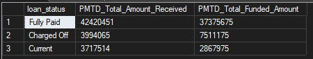

➡️ Compared each segment on:

* Applications
* Amount funded
* Amount collected
* Average interest rate
* Average DTI

## Geographic Business Analysis

### State-wise Loan Demand

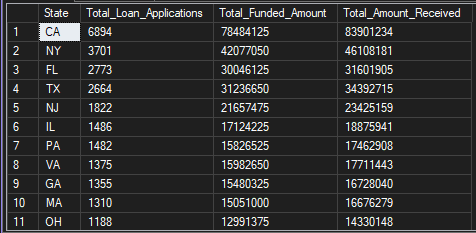

➡️ Ranked states by:

* Number of applications
* Total funded amount
* Total collections

Useful for identifying top-performing markets.

## Time-Series Analysis

### Month-wise Trends

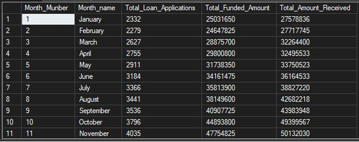

➡️ Grouped loan activity by month to understand:

* Seasonal demand patterns
* Funding cycles
* Collection behavior

## Customer Profile Analysis

### Term-wise Analysis

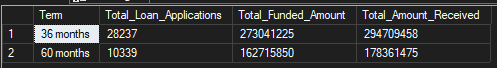

➡️ Compared loans by repayment terms:

* 36 months
* 60 months

Helps evaluate long-term vs short-term portfolio mix.

### Employment Length Analysis

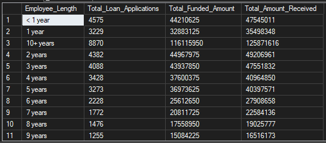

➡️ Studied borrower tenure categories.

Useful for identifying whether experienced workers are lower risk.

### Home Ownership Analysis

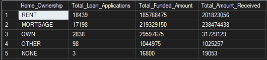

➡️ Compared customers by:

* Rent
* Mortgage
* Own
* Other

Can indicate financial stability trends.

## Purpose-wise Loan Demand

### Most Common Borrowing Reasons:

* Debt Consolidation
* Credit Card
* Home Improvement
* Small Business
* Medical
* Vacation

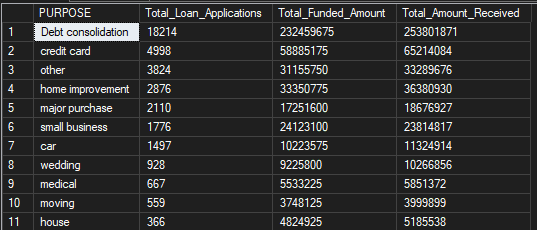

➡️ Helps optimize targeted loan products.

## Advanced Segmented Analysis

### Example 1: Grade A Customers in California

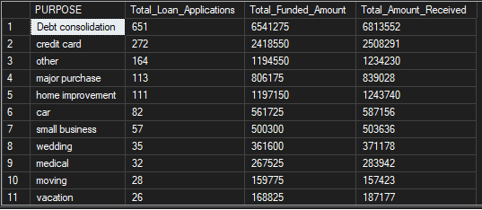

➡️ Filtered high-credit customers from **CA** and analyzed loan purpose.

### Example 2: Grade B Customers in Maryland

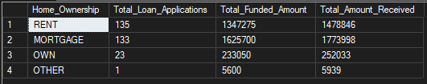

➡️ Studied home ownership trends for mid-grade borrowers in **MD**.

# Key Business Insights

- **Lending Growth:** If MTD > PMTD, loan demand is increasing.

- **Risk Monitoring:** Higher charged-off ratio = weaker credit underwriting.

- **Profitability:** Higher interest + strong collections = better returns.

- **Expansion Opportunity:** States with high demand and low defaults should be growth targets.

- **Customer Strategy:** Debt consolidation and credit card refinancing often dominate loan demand.
# Bank-Loan-Analysis-Project
